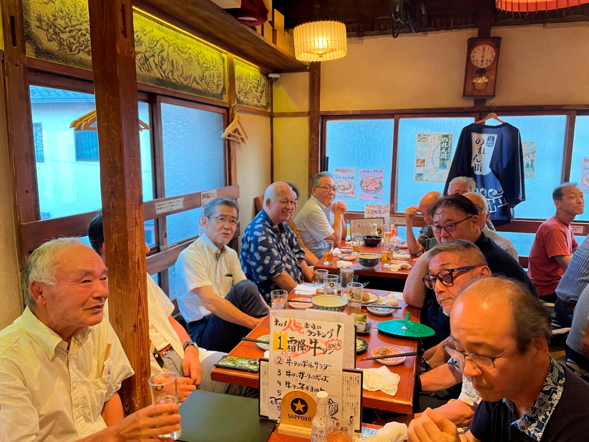
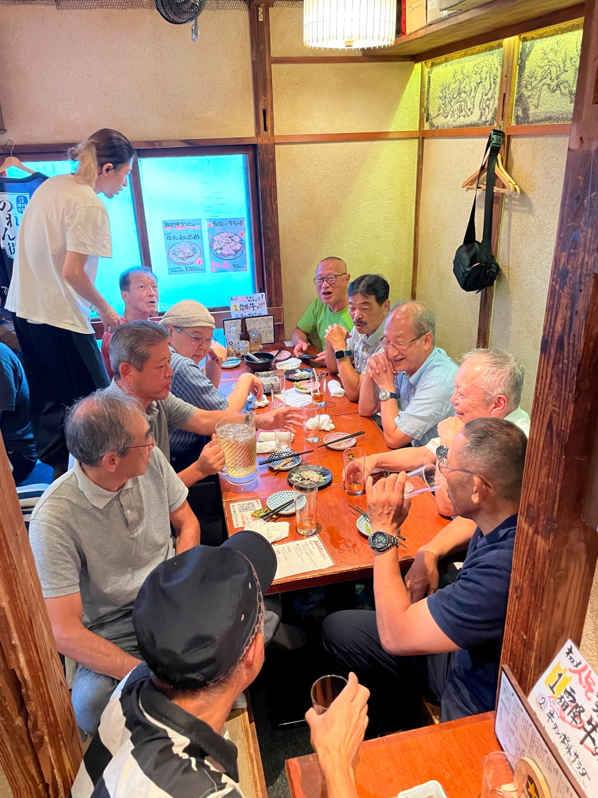
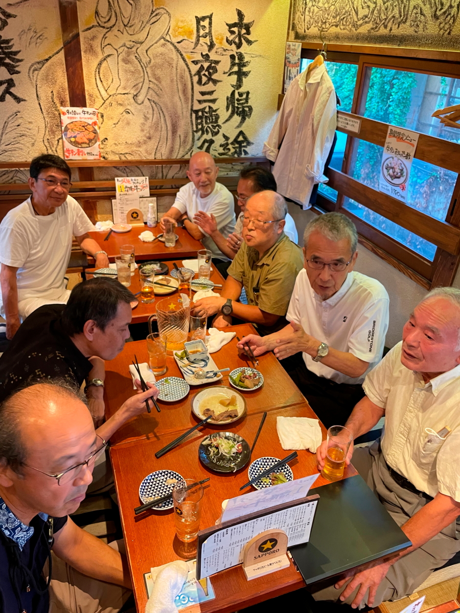
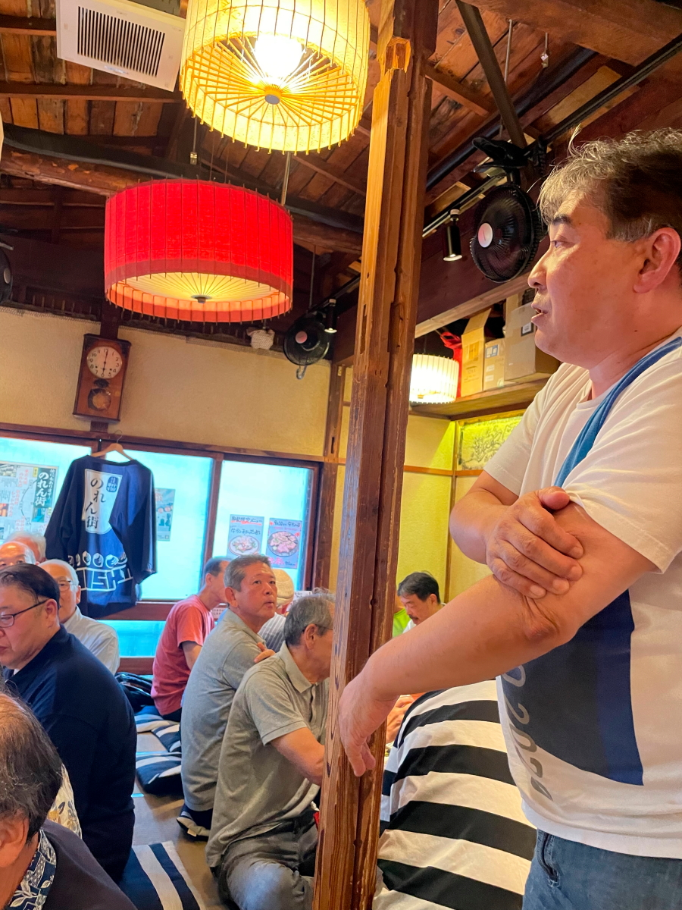
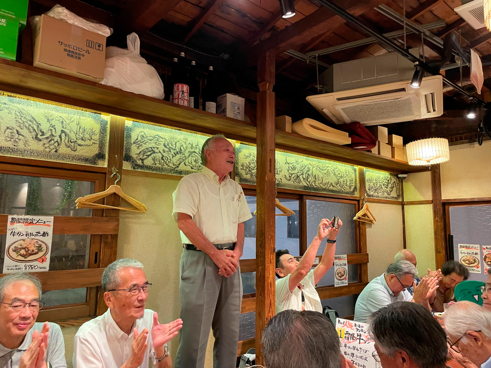
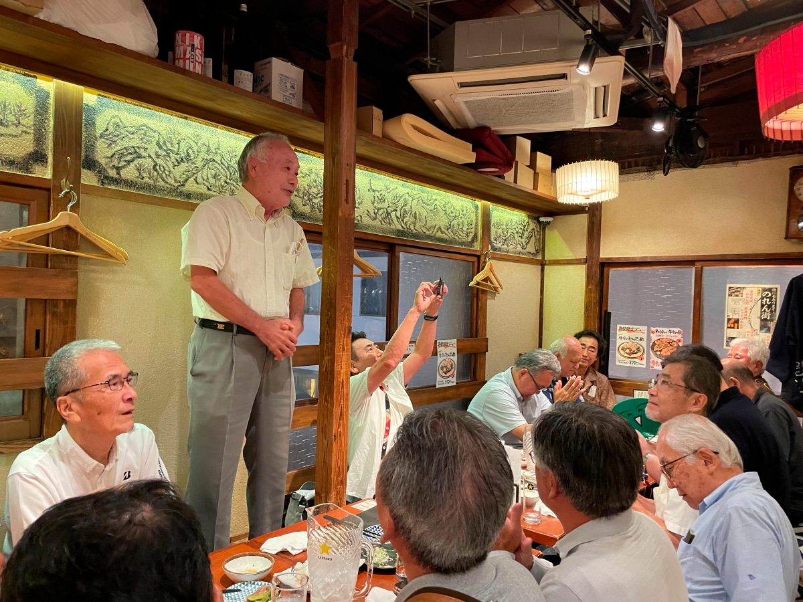
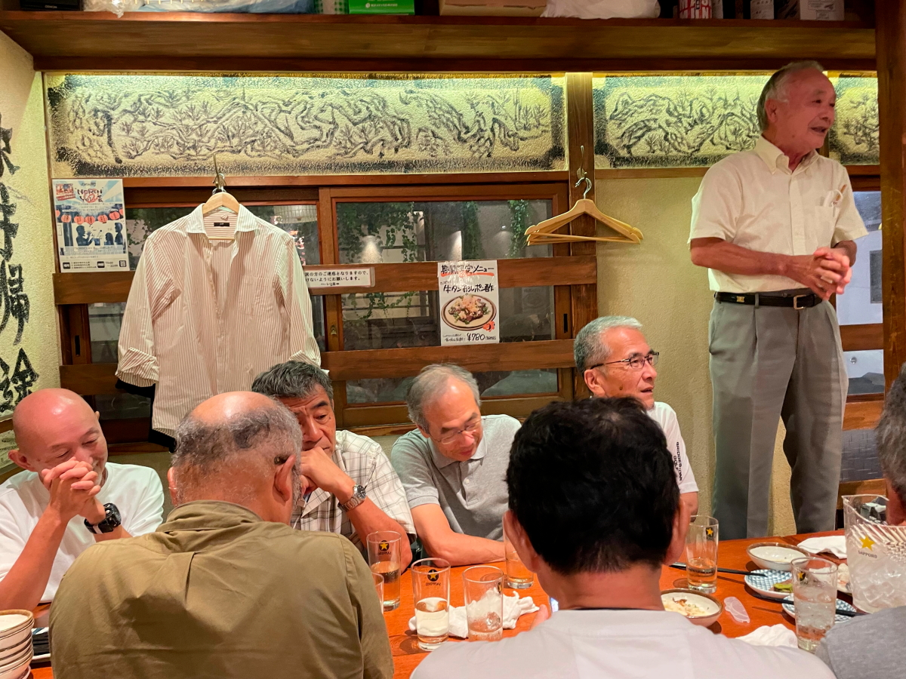
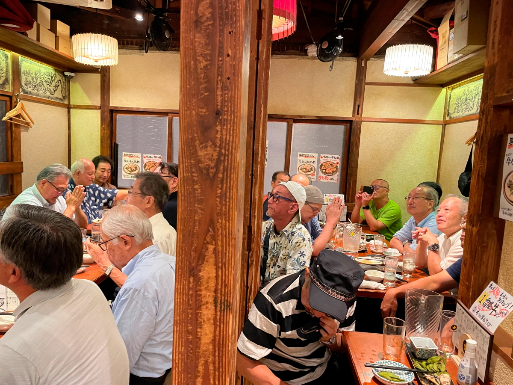
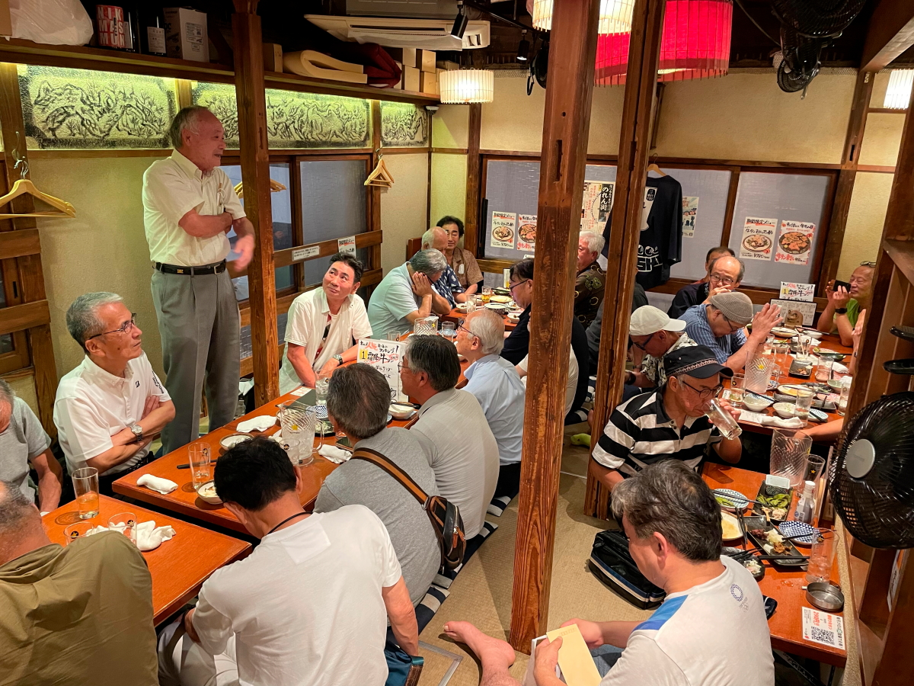
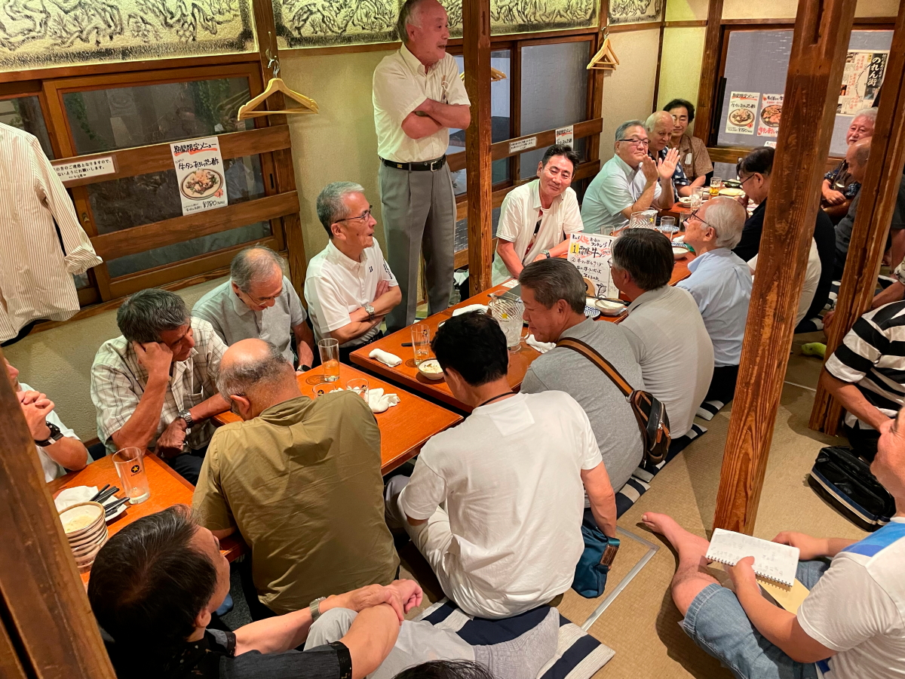

# ooizumi_judo_2024

<html>
<head>

<meta charset="UTF-8">
<meta http-equiv="Content-Type" content="text/html; charset=UTF-8">
<meta http-equiv="X-UA-Compatible" content="IE=EmulateIE10" />
<meta http-equiv="X-UA-Compatible" content="IE=edge">

<!--ここから上はお決まりの定型文です-->

<!--ここからが表現の書式などを決めるcssという部分-->

<link href="https://cdnjs.cloudflare.com/ajax/libs/lightbox2/2.7.1/css/lightbox.css" rel="stylesheet">

</head>

<body>

  モバイル端末をお使いの場合は、画面を横向きにすると
  より見やすくご覧頂けます。

 <!--<a href="https://torokoid.github.io/2024Jan_Thailand_2/" target="_blank">-->アクセス用QRコード<!--</a>-->

    
<!--ここまでは定型文としてそのままコピペして再利用します-->
    
<h1><marquee bgcolor="#ffff00">!!! 入社直後で印象に残った、ブレーキの実車テストの思い出です。羽田 !!!</marquee></h1>
    
                         

<!--
<h1>社歴等</h1>

 
<h1>1983年定期採用、オールホンダで600人採用、HGに300人採用された中の一人。 
当時、四輪開発部隊の中心は和光研究所で、エンジンと車体のテスト部隊のみが芳賀町(HGW-T)に配属。 
600人中27人が宇都宮に送り込まれ、1人は即転職、残りの26人での栃木暮らしがスタートしました。 　⇒　のちに栃木26人衆と呼ばれたメンバーです。 
御料牧場を抜けた先の高根沢エリアはまだ未開の地で、 No無しのモトクロッサーがジャンプしながら走り回るような荒野でした。 
配属直後から車体テスト屋生活、ほぼ一日中PGで過ごす生活が10年。 　⇒　車の運転は神業級になり最終的には室課のドライバー訓練イントラ。 
当時Honda3悪と言われた、エンジン・ミッション・ブレーキの一員として、 LAのアメリカン・ホンダに3か月の長滞。20代の感性にはLAは刺激的過ぎ！ 
D開発からR開発に移り、数々のR開発に従事。 
当時CIVICが初めてアイドルストップしたが、 上り坂で停車後再スタートでエンジンスタートまでの一瞬で後ろに下がる現象でクレーム多発。 　⇒　これを阻止するCAS（Creep Aid System）開発。 
CMBS（自動ブレーキ）の初期開発で追突ギリギリまで前車に突っ込むあり得ないテスト実施。 ・・・このメンバーとは今でも交流があります。 
D室課に戻ってCMBSの量産適用を見極めてホッとしたところで、2000年に立ち上がった「商品技術戦略室」に配属。 
最初は6年で卒業したが、その後ことあるごとに企画系の部署にちょくちょく戻る人生となりました。 
2008年～2012年は和光研究所の未来研で様々な業務に従事。 
　⇒　当時は絵に描いた餅だったITS系のシステムが、次々と現実になっていくのを目にしながらの卒業となりました。 </h1>

 

 
<h2>1980年代の宝積寺エリアと会社周辺の地図、クリックで白地図サイトの地図に飛びます 
    鬼怒川の橋を渡ったエリアは道が通っただけの未開地、今は立派な街です。</h2>

	
                         
                          

     

          

                         
                          

<footer>
    <h2>Copyright S.Hada 2024/Sep/08 @ 大泉高校柔道部、OB会、牛タンいろ葉邸＠代々木</h2>
</footer>
    
<!--HPにさまざまなJavaScriptを呼び込むための書式-->

</body>

</html>
