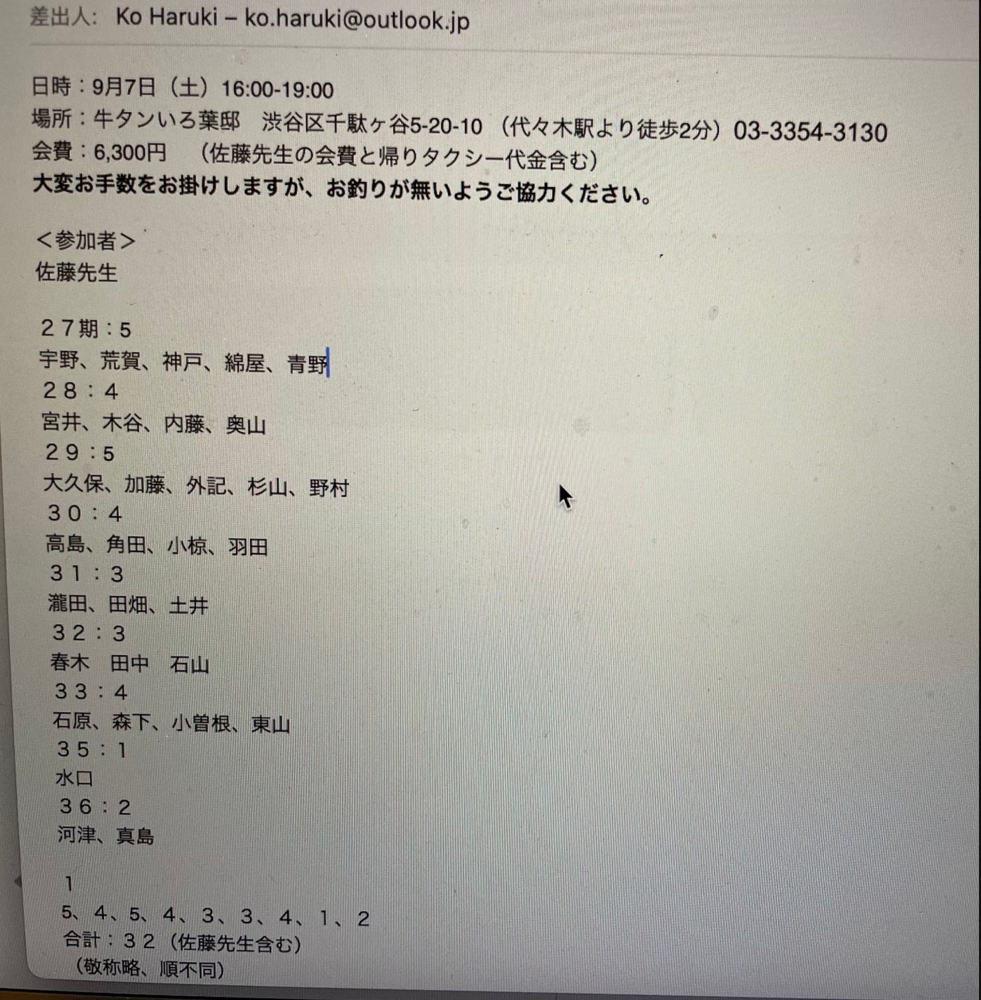

# ooizumi_judo_2024

<html>
<head>

<meta charset="UTF-8">
<meta http-equiv="Content-Type" content="text/html; charset=UTF-8">
<meta http-equiv="X-UA-Compatible" content="IE=EmulateIE10" />
<meta http-equiv="X-UA-Compatible" content="IE=edge">

<!--ここから上はお決まりの定型文です-->

<!--ここからが表現の書式などを決めるcssという部分-->

<link href="https://cdnjs.cloudflare.com/ajax/libs/lightbox2/2.7.1/css/lightbox.css" rel="stylesheet">

</head>

<body>

  モバイル端末をお使いの場合は、画面を横向きにすると
  より見やすくご覧頂けます。

 <!--<a href="https://torokoid.github.io/2024Jan_Thailand_2/" target="_blank">-->アクセス用QRコード<!--</a>-->

    
<!--ここまでは定型文としてそのままコピペして再利用します-->
    
<h1><marquee bgcolor="#ffff00">!!! 2024/ep/07 大泉高校柔道部OB会、牛タンいろ葉邸＠代々木 !!!</marquee></h1>
    
                         

<h1>出席者一覧</h1>

 
<h1>幹事様のお声がけに答えて総勢32名のOB会となりました。 </h1>

 

 
<h2>佐藤先生をはじめ、集まったメンバーは皆お元気です。 
春木さん撮影写真</h2>

	
                         
                          

     

          

                         
                          

<footer>
    <h2>Copyright S.Hada 2024/Sep/08 @ 大泉高校柔道部、OB会、牛タンいろ葉邸＠代々木</h2>
</footer>
    
<!--HPにさまざまなJavaScriptを呼び込むための書式-->

</body>

</html>
